# NL2Cube 智慧分析系統 - 完整系統分析規劃書

## 1. 專案概述

### 1.1 專案背景
NL2Cube 智慧分析系統是一個基於自然語言查詢的商業智慧分析平台，旨在為企業提供直觀、高效的數據分析解決方案。系統採用星狀結構資料庫設計，支援多維度數據分析，並整合 AI 聊天功能，提供智能化的分析建議。此外，系統還整合了 CrewAI 預測系統、向量資料庫和 n8n 工作流程自動化功能。

### 1.2 專案目標
- 建立自然語言查詢介面，降低數據分析門檻
- 提供多維度商業數據分析能力
- 整合 AI 技術，提供智能分析建議
- 支援多種圖表類型，提升數據可視化效果
- 建立可擴展的 MVC 架構系統
- 整合 CrewAI 預測系統，提供智能預測功能
- 建立向量資料庫，支援語義搜尋和分析
- 整合 n8n 工作流程，實現業務流程自動化

### 1.3 專案範圍
- 前端：Web 介面、圖表展示、聊天功能
- 後端：MVC 架構、數據處理、AI 整合
- 資料庫：星狀結構設計、多維度數據模型、向量資料庫
- 分析功能：自然語言解析、多維度分析、NLG 報告生成
- 預測功能：CrewAI 整合、多模型預測、預測停止條件
- 自動化：n8n 工作流程整合、業務流程自動化

## 2. 系統架構設計

### 2.1 整體系統架構

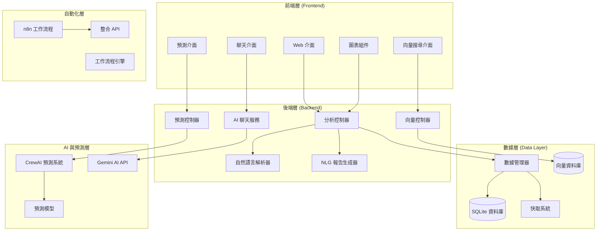

### 2.2 CrewAI 預測系統架構

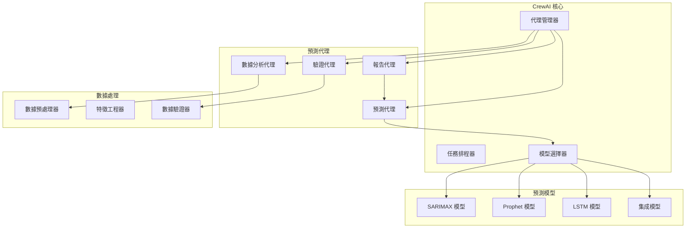

### 2.3 向量資料庫架構

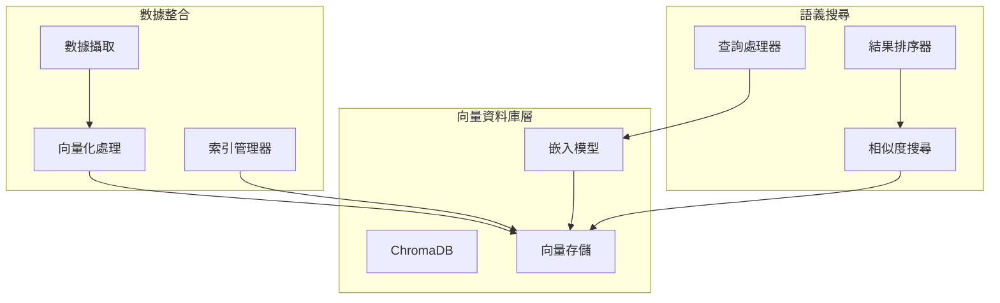

### 2.4 n8n 整合架構

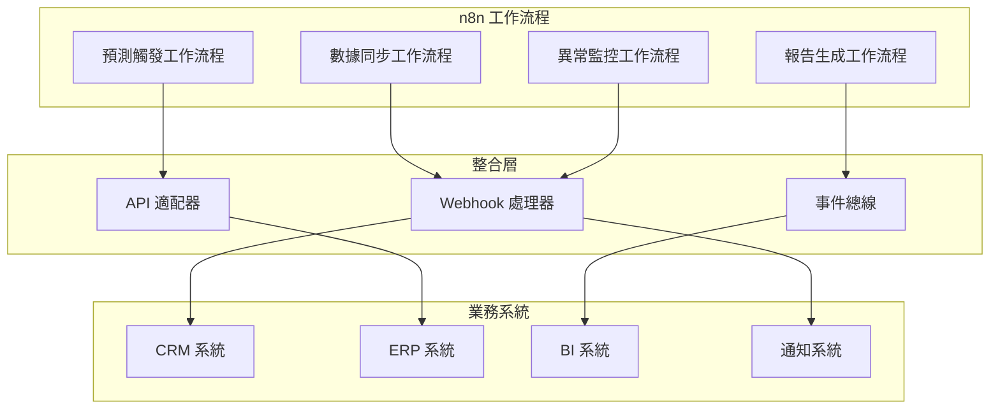

## 3. 核心功能模組

### 3.1 自然語言查詢模組
- **查詢解析**：支援中文自然語言輸入，自動解析查詢意圖
- **多維度分析**：支援產品、人員、地區、時間等多維度數據分析
- **圖表展示**：支援長條圖、圓餅圖等多種圖表類型
- **差異分析**：提供期間比較和貢獻度分析

### 3.2 CrewAI 預測模組
- **多代理協作**：數據分析、預測、驗證、報告生成代理協作
- **多模型支援**：SARIMAX、Prophet、LSTM、集成模型
- **預測停止條件**：智能判斷預測何時停止，避免過度擬合
- **自動化預測**：支援排程預測和觸發式預測

### 3.3 向量資料庫模組
- **語義搜尋**：基於向量相似度的智能搜尋
- **文檔管理**：支援多種文檔格式的向量化存儲
- **相似度分析**：提供文檔相似度計算和聚類分析
- **實時更新**：支援文檔的實時向量化和索引更新

### 3.4 n8n 自動化模組
- **工作流程設計**：可視化工作流程設計器
- **觸發器支援**：支援多種觸發條件（時間、事件、API）
- **數據轉換**：支援複雜的數據轉換和處理邏輯
- **系統整合**：與 CRM、ERP、BI 等系統的深度整合

## 4. 預測停止條件設計

### 4.1 預測停止條件架構

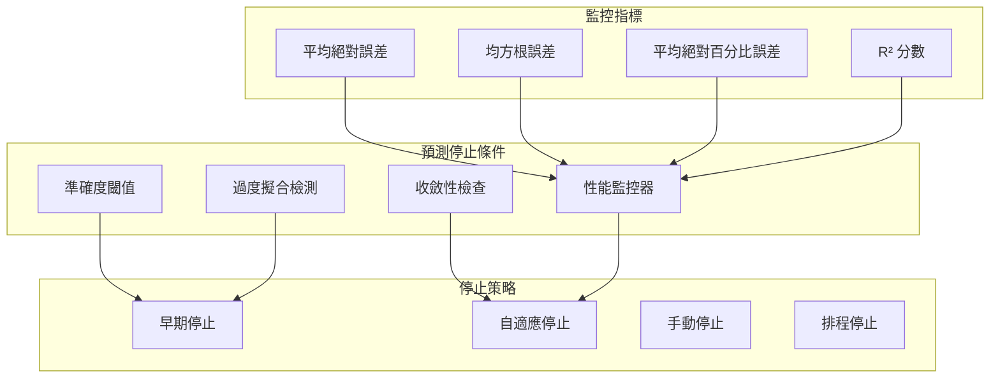

### 4.2 停止條件類型

#### 4.2.1 準確度閾值停止
- **MAE 閾值**：當平均絕對誤差低於設定閾值時停止
- **RMSE 閾值**：當均方根誤差低於設定閾值時停止
- **MAPE 閾值**：當平均絕對百分比誤差低於設定閾值時停止

#### 4.2.2 收斂性檢查停止
- **梯度收斂**：當梯度變化小於閾值時停止
- **參數收斂**：當模型參數變化小於閾值時停止
- **損失收斂**：當損失函數變化小於閾值時停止

#### 4.2.3 過度擬合檢測停止
- **驗證集性能**：當驗證集性能開始下降時停止
- **泛化能力**：當模型泛化能力下降時停止
- **複雜度控制**：當模型複雜度過高時停止

## 5. 數據模型設計

### 5.1 核心數據模型

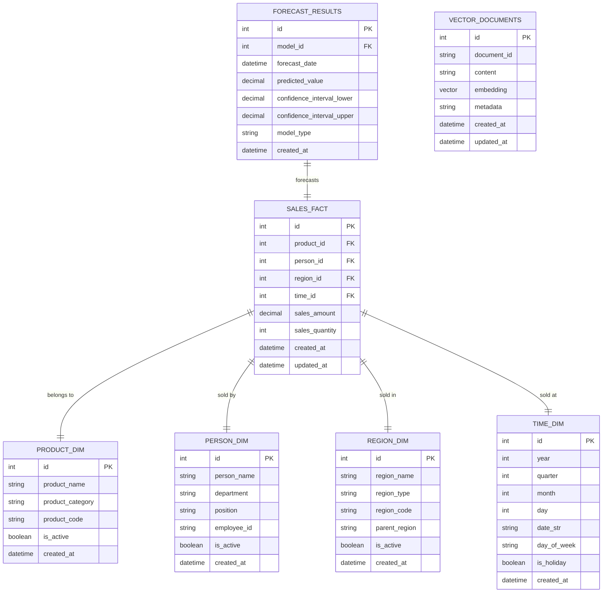

### 5.2 預測數據模型

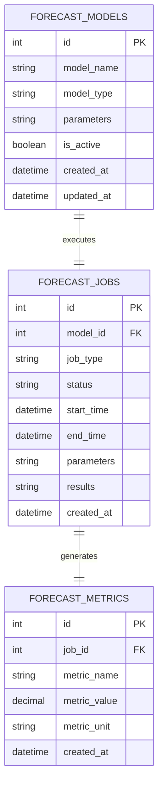

## 6. 系統整合架構

### 6.1 API 整合架構

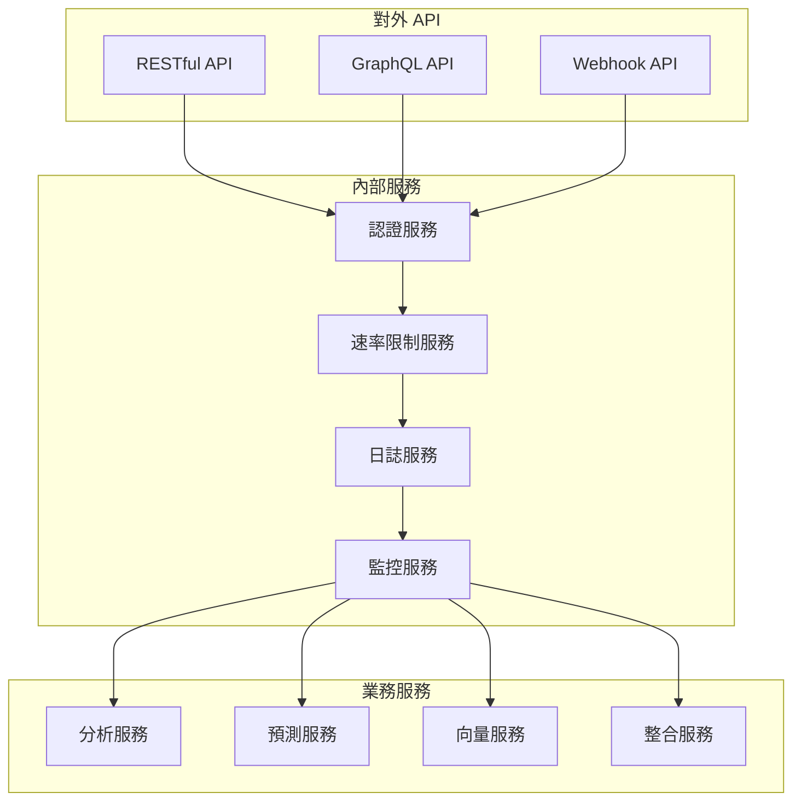

### 6.2 事件驅動架構

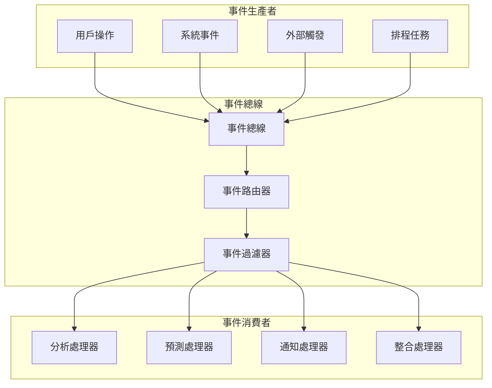

## 7. 性能與擴展性設計

### 7.1 性能優化策略

#### 7.1.1 資料庫優化
- **索引策略**：建立複合索引和查詢優化索引
- **查詢優化**：使用參數化查詢和查詢計劃優化
- **連接池**：實現資料庫連接池管理
- **分頁查詢**：支援大數據集的分頁查詢

#### 7.1.2 快取策略
- **記憶體快取**：使用 Redis 進行記憶體快取
- **查詢快取**：快取常用查詢結果
- **圖表快取**：快取生成的圖表數據
- **預測快取**：快取預測結果

#### 7.1.3 非同步處理
- **任務佇列**：使用 Celery 處理非同步任務
- **批次處理**：支援大批量數據的批次處理
- **並行計算**：支援多核心並行計算

### 7.2 擴展性設計

#### 7.2.1 水平擴展
- **負載均衡**：支援多實例負載均衡
- **微服務架構**：將系統拆分為多個微服務
- **容器化部署**：使用 Docker 和 Kubernetes 部署

#### 7.2.2 垂直擴展
- **資源優化**：優化記憶體和 CPU 使用
- **資料庫分片**：支援資料庫水平分片
- **快取分層**：實現多層快取架構

## 8. 安全性設計

### 8.1 安全架構

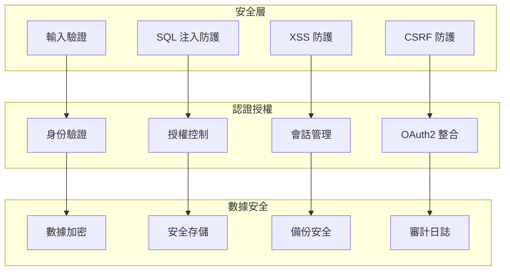

### 8.2 安全實現
- **輸入驗證**：前端和後端雙重驗證
- **SQL 注入防護**：使用參數化查詢
- **XSS 防護**：輸入清理和輸出編碼
- **CSRF 防護**：Token 驗證機制
- **數據加密**：敏感數據加密存儲
- **審計日誌**：完整的操作審計記錄

## 9. 監控與日誌

### 9.1 監控架構

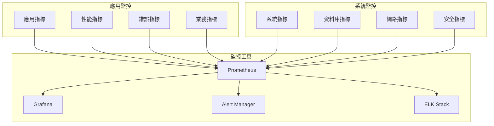

### 9.2 日誌管理
- **結構化日誌**：使用 JSON 格式的結構化日誌
- **日誌分級**：DEBUG、INFO、WARNING、ERROR、CRITICAL
- **日誌輪轉**：自動日誌輪轉和歸檔
- **集中日誌**：集中式日誌收集和分析

## 10. 部署與運維

### 10.1 部署架構

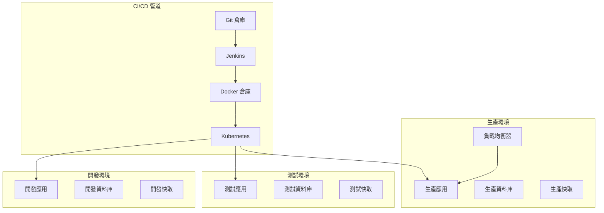

### 10.2 運維策略
- **自動化部署**：使用 CI/CD 管道自動化部署
- **容器化部署**：使用 Docker 和 Kubernetes 部署
- **配置管理**：使用環境變數和配置檔案管理
- **備份策略**：定期備份資料庫和配置檔案

## 11. 風險評估與對策

### 11.1 技術風險
- **AI API 依賴**：建立備用方案和錯誤處理
- **資料庫性能**：索引優化和查詢優化
- **安全性**：輸入驗證和 SQL 注入防護
- **系統穩定性**：完善的錯誤處理和日誌記錄

### 11.2 業務風險
- **用戶接受度**：提供詳細使用指引
- **數據品質**：建立數據驗證機制
- **系統穩定性**：完善的錯誤處理和日誌記錄
- **預測準確性**：多模型驗證和持續優化

### 11.3 運維風險
- **系統可用性**：建立監控和告警機制
- **數據安全**：定期備份和災難恢復
- **性能瓶頸**：性能監控和優化
- **擴展性**：設計可擴展的架構

## 12. 專案時程規劃

### 12.1 開發階段
1. **需求分析與設計**（2-3 週）
2. **核心功能開發**（4-5 週）
3. **AI 功能整合**（2-3 週）
4. **CrewAI 預測系統**（3-4 週）
5. **向量資料庫整合**（2-3 週）
6. **n8n 自動化整合**（2-3 週）
7. **測試與優化**（2-3 週）
8. **部署與上線**（1-2 週）

### 12.2 維護階段
- 定期功能更新
- 性能監控和優化
- 用戶反饋收集和改進
- 預測模型持續優化

## 13. 成功指標

### 13.1 技術指標
- 查詢響應時間 < 3 秒
- 系統可用性 > 99%
- 錯誤率 < 1%
- 預測準確率 > 85%

### 13.2 業務指標
- 用戶滿意度 > 90%
- 查詢準確率 > 95%
- 功能使用率 > 80%
- 預測決策支援率 > 90%

## 14. 結論

NL2Cube 智慧分析系統採用現代化的技術架構和設計模式，提供了一個功能完整、可擴展的商業智慧分析解決方案。通過整合 CrewAI 預測系統、向量資料庫和 n8n 自動化功能，系統不僅能夠提供傳統的數據分析能力，還能夠支援智能預測、語義搜尋和業務流程自動化。

系統的微服務架構設計確保了代碼的可維護性和可擴展性，為未來的功能擴展和系統升級奠定了堅實的基礎。通過完善的監控、日誌和安全性設計，系統能夠穩定運行並保護用戶數據安全。

這份完整的系統分析規劃書為系統的開發、維護和擴展提供了全面的技術指導，確保系統能夠滿足企業的各種數據分析和預測需求。 